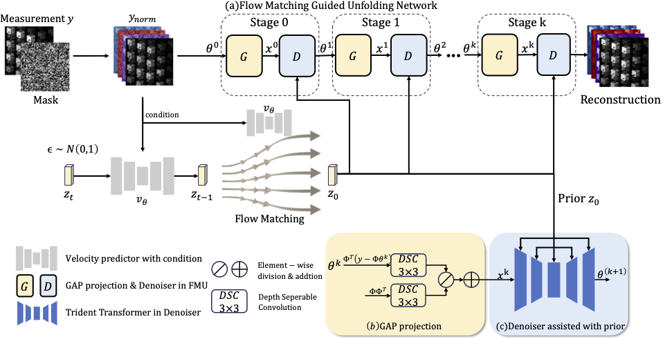

# Flow-Matching Guided Deep Unfolding for Hyperspectral Image Reconstruction

[](https://arxiv.org/abs/2510.01912)
[](https://github.com/YiAi03/FMU)

#### Authors

Yi Ai, Yuanhao Cai, Yulun Zhang, Xiaokang Yang

#### 🔥🔥🔥 News

- **2025-10-01:** This repo is released.

---

> **Abstract:** Hyperspectral imaging (HSI) provides rich spatial–spectral information but remains costly to acquire due to hardware limitations and the difficulty of reconstructing three-dimensional data from compressed measurements. Although compressive sensing systems such as CASSI improve efficiency, accurate reconstruction is still challenged by severe degradation and loss of fine spectral details. We propose the \textit{Flow-Matching-guided Unfolding network} (FMU), which, to our knowledge, is the first to integrate flow matching into HSI reconstruction by embedding its generative prior within a deep unfolding framework. To further strengthen the learned dynamics, we introduce a mean velocity loss that enforces global consistency of the flow, leading to a more robust and accurate reconstruction. This hybrid design leverages the interpretability of optimization-based methods and the generative capacity of flow matching. Extensive experiments on both simulated and real datasets show that FMU significantly outperforms existing approaches in reconstruction quality.


## ⚒️ TODO

* [ ] Release code and models

## 🔎 Method Overview


## <a name="results"></a>🔎 Results


Quantitative results (PSNR/SSIM) of hyperspectral image reconstruction across ten representative scenes from simulated dataset in optical filter-based system and the overall average. A variety of state-of-the-art methods are compared to demonstrate the effectiveness of our approach.

## <a name="citation"></a>📎 Citation

If you find the code helpful in your research or work, please cite our work.

```
@artile{ai2025flow,
      title={Flow-Matching Guided Deep Unfolding for Hyperspectral Image Reconstruction}, 
      author={Yi Ai, Yuanhao Cai, Yulun Zhang and Xiaokang Yang},
      journal={arXiv preprint arXiv:2510.01912}
      year={2025}
}
```
